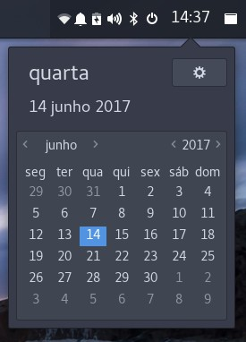

# calendar-applet
A budgie-desktop applet to show hours and when click show a calendar in a popover

## Dependencies
```
vala
gtk+-3.0
budgie-1.0
```

SOLUS
```
sudo eopkg it budgie-desktop-devel libgnome-desktop-devel vala
```

### Installing from source
```
mkdir build && cd build
meson --prefix /usr --buildtype=plain ..
ninja
sudo ninja install
```

### Arch
you can install that applet on archlinux with aur : [budgie-calendar-applet](https://aur.archlinux.org/packages/budgie-calendar-applet)

### Translate
You can help translating this applet on: [Transifex](https://www.transifex.com/danielpinto8zz6/budgie-calendar-applet)

### Screenshot

